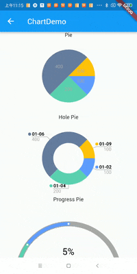
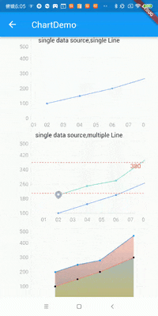

## Flutter_chart

这是一款轻量级的flutter版本chart组件，目前已支持LineChart、BarChart、PieChart。






### 为何自己造轮子？
市面上有很多种chart，经过长时间的调研，发现没有一款完成符合自己需求的组件，有的样式太过个性化比如fl_chart，有的功能太简单，找了许久感觉graphic最合适，但是在项目使用过程中发现一些bug， 
也反馈了一些问题，或许作者有其他计划感觉项目推进缓慢，当然这个库也不能满足需求，可能需要花费大量精力去研究进行自定义，有些功能可能还实现不了，所以就照着需求撸一个更合适的。

这里还有一点是一些组件为了设计可能对数据各种遍历，当数据量大的时候会有性能瓶颈问题，比如graphic只支持一个数组，那么像一个数组要画多条线时需要自己来循环磨平，再加上框架各种计算数组会循环很多遍。

当然自己造了个轮子也不是什么都支持的，所以首要目的是满足基本功能之余代码尽可能精简、独立，让使用者可以二次开发或者在之前的基础上容易扩展，最主要的是本组件支持数组内画多条图形，而仅仅一次遍历就可以了。

本项目是基于坐标系+图形两种概念实现，提供了两个坐标系：DimensionsChartCoordinateRender象限坐标系和CircularChartCoordinateRender圆形坐标系 + 各种对应的图形render + 各种annotation，这三个各种组合基本可以满足绝大部分场景。

当然了，如果满足不了你的需求，你可以重写ChartRender自己绘制，如果是需要增强能力则可以通过增加Annotation（在example中有使用，可以查看如何使用），甚至可以自定义Annotation。


该组件支持缩放、水平滚动、选中变色、自定义标注、x轴缩放变换等功能，并且使用很简单，代码量极少，可扩展性极强。
主要特色如下

## 主要功能：

### 1、支持line、bar、pie、progress等常规图形
    1）、支持line和bar多图形任意组合
    2）、图形支持过渡色
    3）、bar支持多个一组，且可以横排或竖排
    4）、pie支持点击、空心等设置
    5）、progress支持各种自定义
    6）、支持多个y轴配置
#### 2、支持各种annotation，如ImageAnnotation、LabelAnnotation
    1）、支持各种样式的标注
    2）、标注可自定义是否跟随滚动
    3）、标注可点击可携带信息便于点击处理
    4）、标注支持缩放范围设置，可在某一个缩放比例范围内才显示出来。
### 3、DimensionsChartCoordinateRender坐标系x轴支持放大、缩小后动态设置
    1）、放大后可以在空隙中显示更精确的刻度，如时间坐标以天分隔，放大后天之间显示小时刻度
    2）、缩小后刻度过于密集会自动过滤
### 4、支持图表分层，分为弹框层、前景层、图表层。
    1）、弹框层用于显示用户点击后的信息，也支持用canvas绘制，用户可自由选择
    2）、前景层可以放任何的widget，便于在chart添加一些说明而不被弹框挡住
    3）、支持设置安全区域让弹框更容易定制范围
### 5、图形支持逆序渲染

## 未来
### 6、支持从右侧不断添加数据，用于支撑血氧数据添加

BarChart:
```dart

SizedBox(
height: 200,
child: ChartWidget(
    coordinateRender: LineBarChartCoordinateRender(
    yAxis: [
      YAxis(
        min: 0,
        max: 500,
      )
    ],
    margin: const EdgeInsets.only(left: 40, top: 0, right: 0, bottom: 30),
    xAxis: XAxis(
      count: 7,
      max: 30,
      formatter: (index) {
        return startTime.add(Duration(days: index)).toStringWithFormat(format: 'dd');
      },
    ),
    charts: [
      StackBar(
        data: dataList,
        position: (item) {
          return parserDateTimeToDayValue(item['time'] as DateTime, startTime);
        },
        direction: Axis.horizontal,
        itemWidth: 10,
        highlightColor: Colors.yellow,
        values: (item) => [
          double.parse(item['value1'].toString()),
          double.parse(item['value2'].toString()),
          double.parse(item['value3'].toString()),
        ],
      ),
    ],
  ),
),
)  

```

LineChart

```dart
       
 SizedBox(
// color: Colors.yellow,
height: 200,
child: ChartWidget(
    coordinateRender: LineBarChartCoordinateRender(
    margin: const EdgeInsets.only(left: 40, top: 5, right: 30, bottom: 30),
    //提示的文案信息
    crossHair: const CrossHairStyle(adjustHorizontal: true, adjustVertical: true),
    tooltipFormatter: (list) => TextSpan(
      text: list.map((e) => e['value1']).toString(),
      style: const TextStyle(
        color: Colors.black,
      ),
    ),
    yAxis: [
      YAxis(min: 0, max: 500, drawGrid: true),
      YAxis(min: 0, max: 400, offset: (size) => Offset(size.width - 70, 0)),
    ],
    xAxis: XAxis(
      count: 7,
      max: 20,
      drawLine: false,
      formatter: (index) => startTime.add(Duration(days: index)).toStringWithFormat(format: 'dd'),
    ),
    charts: [
      Bar(
        color: Colors.yellow,
        data: dataList,
        yAxisPosition: 1,
        position: (item) => parserDateTimeToDayValue(item['time'] as DateTime, startTime),
        value: (item) => item['value1'],
      ),
      Line(
        data: dataList,
        position: (item) => parserDateTimeToDayValue(item['time'] as DateTime, startTime),
        values: (item) => [
          item['value1'] as num,
        ],
      ),
      Line(
        colors: [Colors.green],
        data: dataList,
        position: (item) => parserDateTimeToDayValue(item['time'] as DateTime, startTime),
        values: (item) => [
          item['value2'] as num,
        ],
      ),
    ],
  ),
),
)


```

PieChart

```dart

SizedBox(
  height: 200,
  child: ChartWidget(
      coordinateRender: PieChartCoordinateRender(
      margin: const EdgeInsets.only(left: 40, top: 0, right: 0, bottom: 10),
      charts: [
        Pie(
          data: dataList,
          position: (item) => (double.parse(item['value1'].toString())),
          holeRadius: 40,
          valueTextOffset: 20,
          centerTextStyle: const TextStyle(color: Colors.black, fontSize: 16, fontWeight: FontWeight.bold),
          valueFormatter: (item) => item['value1'].toString(),
        ),
      ],
    ),
  ),
),

```

提示：本项目没有计算最大值和最小值，两周的最大值和最小值有需要自己计算，因为组件来计算也是循环遍历反而会